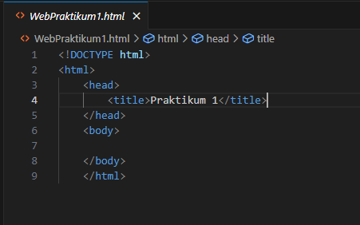
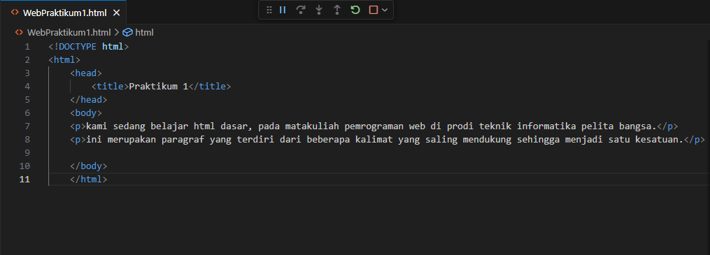
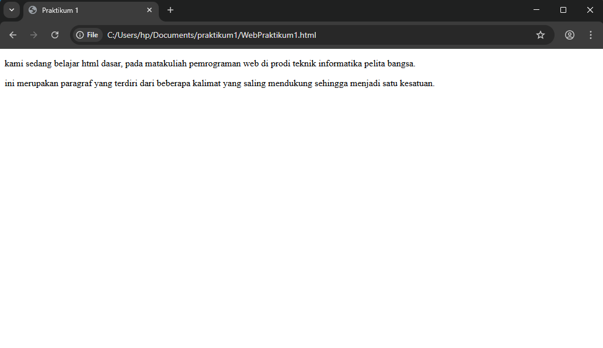
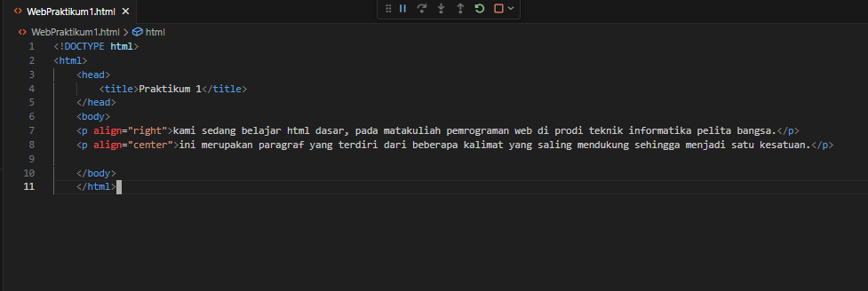
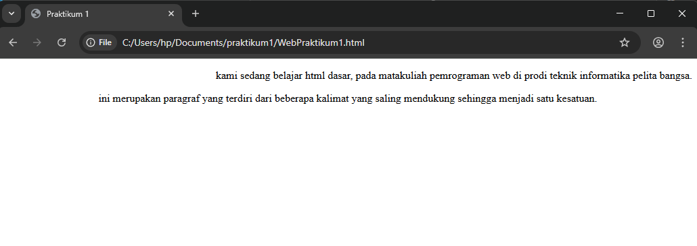
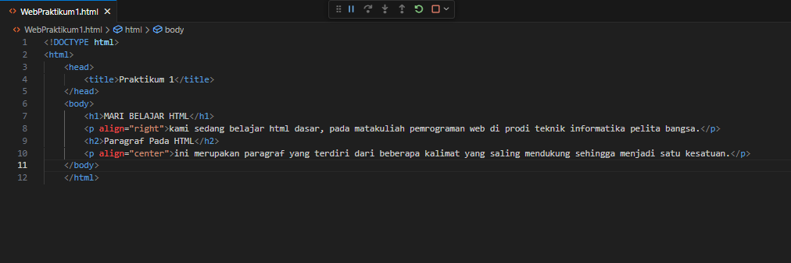
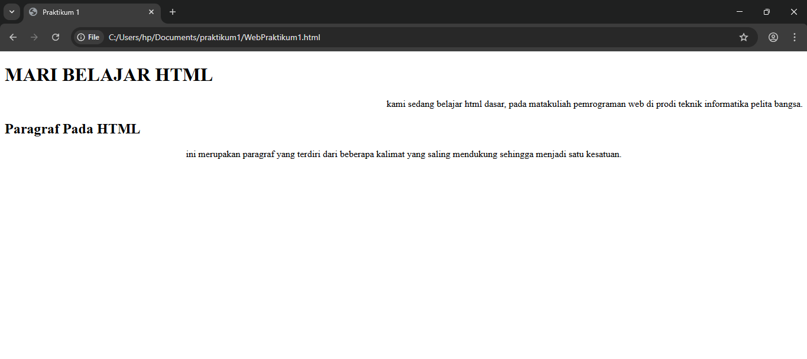
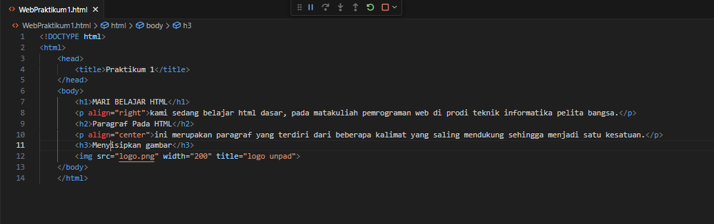
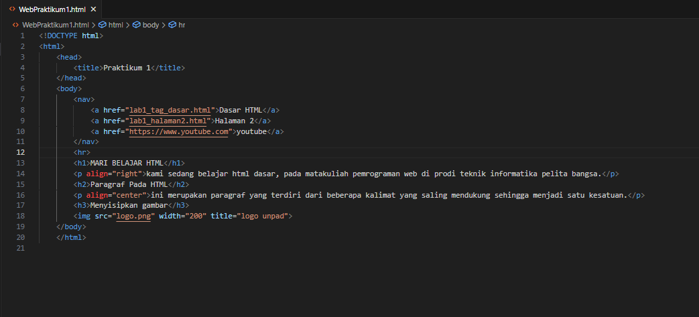
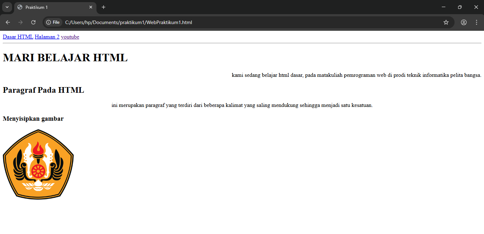

# Lab1Web

Nama: Sayyid Sulthan Abyan

NIM: 312410496

Kelas: TI.24.A.5

## Penjelasan setiap langkah beserta screenshotnya

### langkah 1

### langkah 2

### langkah 3

### langkah 4

### langkah 5

### langkah 6

