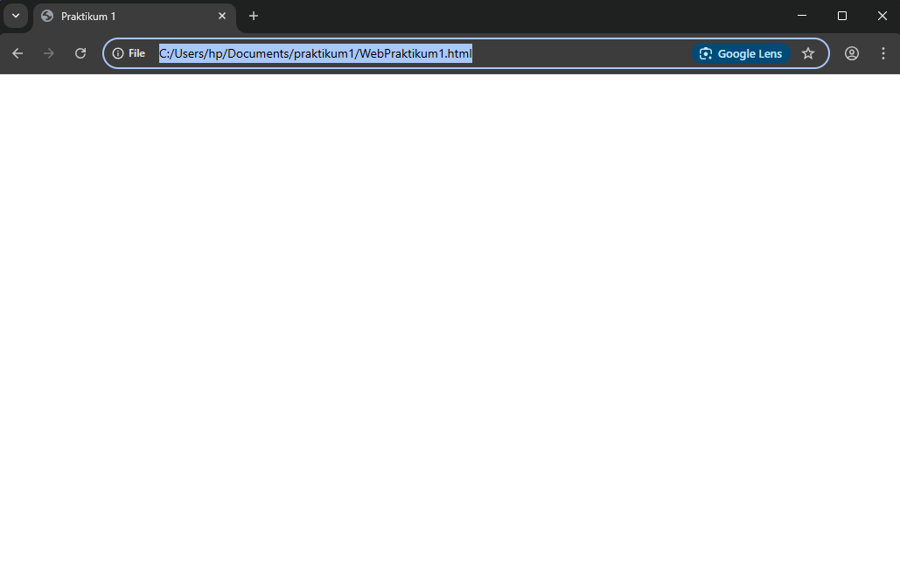

# Lab1Web

Nama: Sayyid Sulthan Abyan

NIM: 312410496

Kelas: TI.24.A.5

## Jawaban pertanyaan

### 1. Lakukan perubahan pada kode sesuai dengan keinginan anda, amati perubahannya adakah error ketika terjadi kesalahan penulisan tag?
Jika kita melakukan perubahan kode HTML dan salah menuliskan tag (misalnya `
` ditulis `<pp>` atau lupa menutup `
`), maka browser biasanya tetap berusaha menampilkan halaman, tetapi hasilnya tidak sesuai harapan. Jadi tidak muncul "error" seperti di bahasa pemrograman lain, tetapi tampilan bisa rusak, tidak rapi, atau struktur dokumen menjadi kacau.

---

### 2. Apa perbedaan dari tag `
` dengan tag ` `, berikan penjelasannya!
- Tag `
` digunakan untuk membuat **paragraf baru**. Setiap kali menulis `
...
` akan membuat blok teks baru dengan jarak atas dan bawah otomatis.
- Tag ` ` digunakan untuk **membuat baris baru** (line break) tanpa memulai paragraf baru. Jadi ` ` hanya turun ke baris berikutnya tanpa ada spasi tambahan seperti pada `
`.

---

### 3. Apa perbedaan atribut `title` dan `alt` pada tag ``, berikan penjelasannya!
- **Atribut `alt`** (alternative text) berfungsi sebagai teks pengganti gambar jika gambar tidak bisa ditampilkan (misalnya file hilang atau koneksi lambat). Alt juga penting untuk aksesibilitas (screen reader untuk pengguna tunanetra).
- **Atribut `title`** memberikan informasi tambahan yang akan muncul sebagai tooltip (teks melayang) ketika pengguna mengarahkan kursor ke gambar.

---

### 4. Untuk mengatur ukuran gambar, digunakan atribut `width` dan `height`. Agar tampilan gambar proporsional sebaiknya kedua atribut tersebut diisi semua atau tidak? Berikan penjelasannya!
Agar gambar tetap proporsional, sebaiknya cukup isi salah satu atribut saja (misalnya `width` saja). Jika kedua atribut diisi manual dan tidak sesuai dengan ukuran asli gambar, maka gambar bisa terlihat gepeng atau melebar tidak proporsional. Jika hanya salah satu atribut diatur, browser akan otomatis menyesuaikan sisi lainnya agar proporsional.

---

### 5. Pada link tambahkan atribut `target` dengan nilai atribut bervariasi (`_blank`, `_self`, `_top`, `_parent`), apa yang terjadi pada masing-masing nilai atribut tersebut?
- `target="_blank"` → Membuka link di tab atau jendela baru.
- `target="_self"` → Membuka link di halaman yang sama (default).
- `target="_top"` → Membuka link di jendela penuh, menghapus semua frame (jika ada).
- `target="_parent"` → Membuka link di halaman induk (parent frame) jika halaman berada dalam sebuah frame.

## Penjelasan singkat setiap langkah beserta screenshotnya

### langkah 1

Menentukan judul halaman yang akan muncul di tab browser, yaitu "Praktikum 1".

### langkah 2

Membuat paragraf

### langkah 3

Membuat parafgraf dengan teks rata kanan atau center, bisa juga yang lain nya tinggal disesuaikan aja

### langkah 4

Membuat Judul dan Subjudul dengan h1 dan h2

### langkah 5

Menambahkan Subjudul lagi dengan h3 dan menambahkan foto

### langkah 6
- Membuat link ke file lab1_tag_dasar.html dengan teks "Dasar HTML".
- Membuat link ke file lab1_Halaman2.html dengan teks "Halaman 2".
- Membuat link eksternal ke website Youtube

