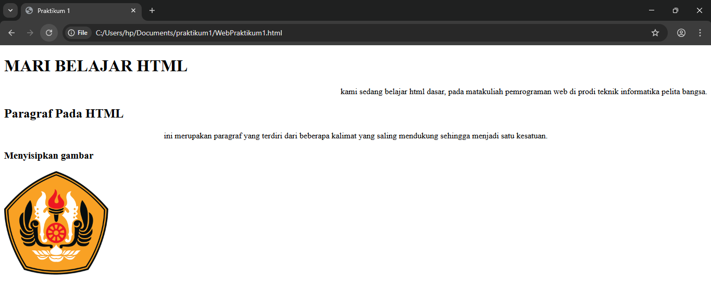

# Lab1Web

Nama: Sayyid Sulthan Abyan

NIM: 312410496

Kelas: TI.24.A.5

## Penjelasan singkat setiap langkah beserta screenshotnya

### langkah 1

Menentukan judul halaman yang akan muncul di tab browser, yaitu "Praktikum 1".

### langkah 2

Membuat paragraf

### langkah 3

Membuat parafgraf dengan teks rata kanan atau center, bisa juga yang lain nya tinggal disesuaikan aja

### langkah 4

Membuat Judul dan Subjudul dengan h1 dan h2

### langkah 5

Menambahkan Subjudul lagi dengan h3 dan menambahkan foto

### langkah 6
- Membuat link ke file lab1_tag_dasar.html dengan teks "Dasar HTML".
- Membuat link ke file lab1_Halaman2.html dengan teks "Halaman 2".
- Membuat link eksternal ke website Youtube

